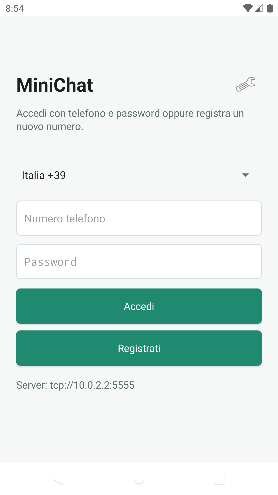
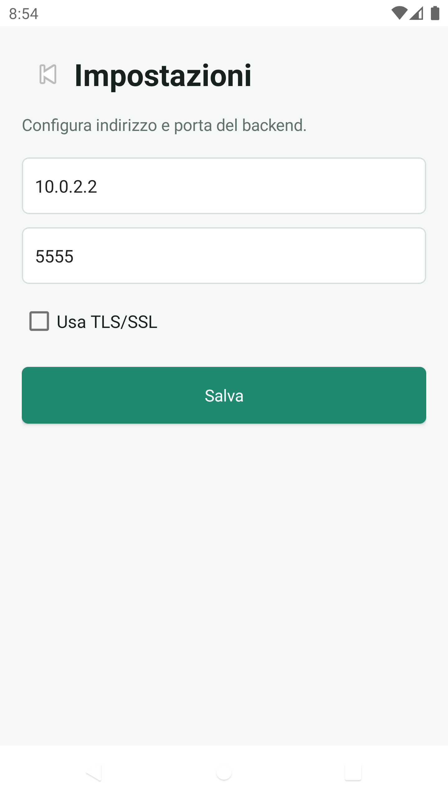
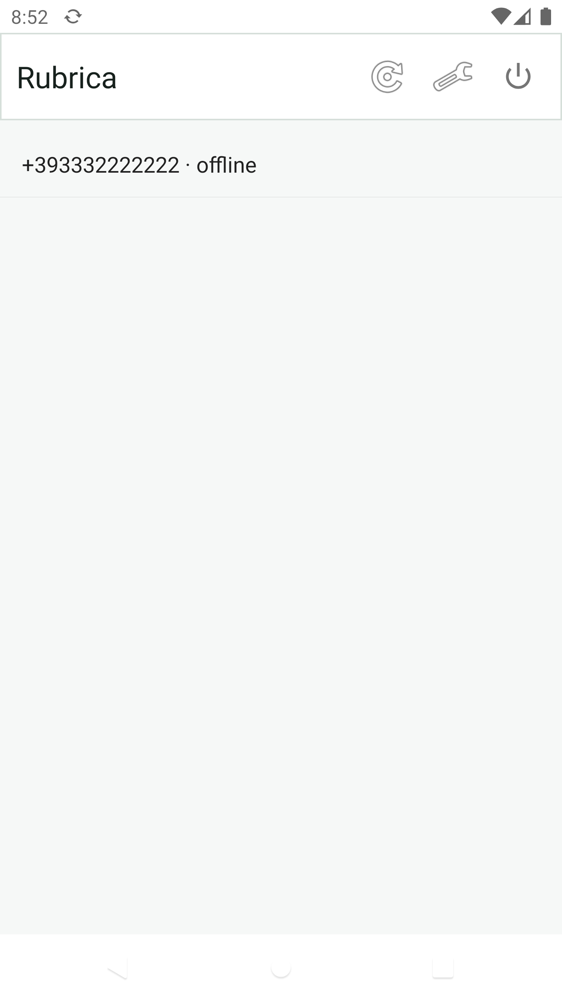
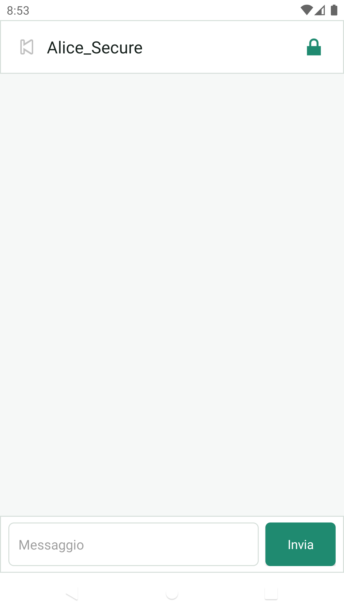
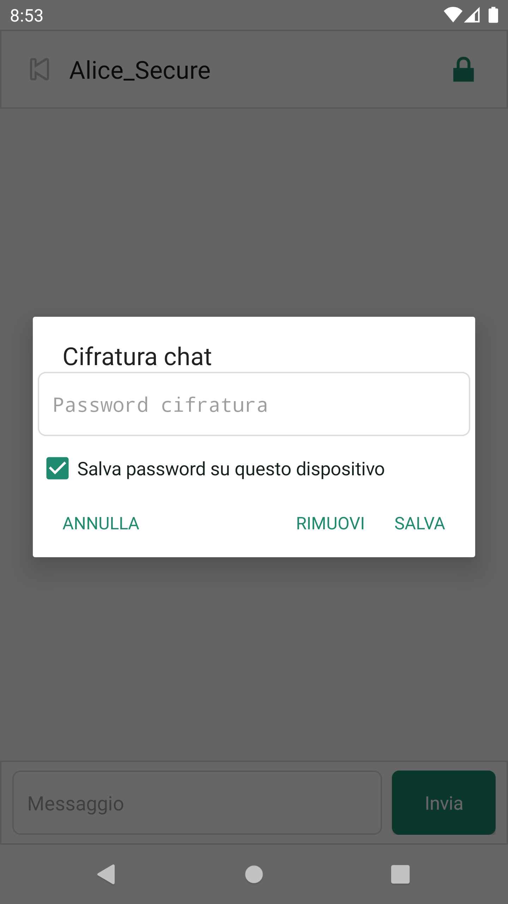
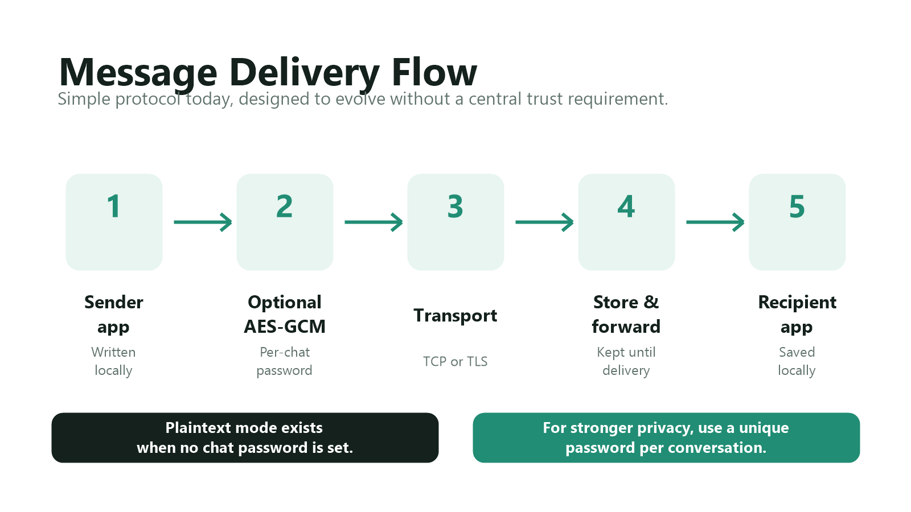

# MiniChat


MiniChat is a small Android messaging prototype with a minimal WhatsApp-style flow:
login, contact list, chat screen, configurable backend, local conversation history,
and a simple C++ store-and-forward server.

This repository is organized for public GitHub publishing. The private central
service endpoint used by private builds is intentionally not present in these
sources, screenshots, binaries, or documentation.

## Repository Layout

```text
android/
  source/              Android Studio / Gradle project
  screenshots/         App screenshots for the GitHub page

server/
  source/              Single-file C++ backend plus build scripts

graphics/              Privacy and encryption promotional graphics
README.md
.gitignore
```

## Screenshots

<p>
  
  
  
  
  
</p>

## How It Works

1. The user selects an international phone prefix, enters a phone number and password, then registers with an OTP.
2. The Android app stores the session locally and keeps the user logged in until explicit logout.
3. The app reads the device address book, normalizes phone numbers, and asks the server which contacts are registered.
4. Only registered numbers already present in the local address book appear in the chat list.
5. A chat message is sent to the backend with the recipient user id.
6. If the recipient is online, the backend forwards the payload immediately.
7. If the recipient is offline, the backend stores the pending payload and deletes it after delivery.
8. Conversations are stored locally on the Android device.

## Android App

Open `android/source` in Android Studio, or build from a terminal:

```bash
cd android/source
./gradlew assembleDebug
```

On Windows:

```powershell
cd android\source
.\gradlew.bat assembleDebug
```


```

Install it with ADB:

```bash
adb install -r android/build/app-debug.apk
```

The app settings screen lets the user configure:

- backend host or IP address
- backend port
- TLS/SSL client mode

Public build note: this repository does not embed any private central server
address. Public builds are intended to use a user-configured backend.

## Backend Server

The backend is intentionally small: one C++ file that opens a socket, accepts
clients, authenticates users, tracks online sessions, syncs reachable contacts,
and routes messages by user id.

Default port:

```text
5555
```


Build on Windows from source:

```powershell
cd server\source
g++ -std=c++17 -O2 chat_server.cpp -lws2_32 -lwininet -lcrypt32 -o chat_server.exe
.\chat_server.exe 5555
```

Build on Ubuntu:

```bash
sudo apt update
sudo apt install -y build-essential libssl-dev
cd server/source
chmod +x build_linux.sh
./build_linux.sh
./chat_server 5555
```

The server listens on `0.0.0.0:<port>`.

## OTP Setup

For local testing, enable console OTP mode. The server will accept and print the
test code `000000`.

Windows PowerShell:

```powershell
$env:MINICHAT_OTP_CONSOLE="1"
.\chat_server.exe 5555
```

Linux:

```bash
MINICHAT_OTP_CONSOLE=1 ./chat_server 5555
```

For SMS delivery, configure Textbelt:

```bash
export MINICHAT_TEXTBELT_KEY="your-textbelt-key"
./chat_server 5555
```

If no key is provided, the server uses Textbelt's `textbelt` test key behavior.

## Server Storage

The server creates runtime files next to the executable:

```text
minichat_store_key
users.tsv
pending_messages.tsv
```

Do not commit these files. Back them up together if you want to preserve users
and pending messages across a machine move.

Storage behavior:

- `users.tsv` is encrypted at rest.
- `pending_messages.tsv` is encrypted at rest.
- `minichat_store_key` is a generated random portable storage key with no extension.
- Moving server state to another machine requires moving the key file too.

## Security Model



Implemented today:

- Android local storage uses AES-GCM.
- Android stores a random data key wrapped by AndroidKeyStore.
- The app caches the local data key in memory after startup.
- Optional per-chat payload encryption uses AES/GCM/NoPadding.
- Chat encryption keys are derived with PBKDF2WithHmacSHA256, 600,000 iterations, 256-bit AES key size.
- Each encrypted chat message uses a random 96-bit GCM IV.
- Chat passwords are not sent to the backend.
- Server user and pending-message files are encrypted at rest.
- Pending messages are deleted immediately after successful delivery.

Important limits:

- If no chat password is set, message payloads are sent in plaintext.
- The current backend protocol is plain TCP. Use the Android TLS setting only when a TLS endpoint or proxy is in front of the server.
- Login passwords are stored inside the encrypted server user database, but they are not password-hashed yet.
- This is a development prototype, not a formally audited secure messenger.

## Reverse Proxy / TLS Deployment

For a public server, place the backend behind a TLS-capable TCP proxy or tunnel.
The Android client can connect with TLS enabled when the exposed endpoint speaks
TLS and forwards the decrypted stream to the backend.

Operational recommendations:

- restrict backend firewall exposure to the proxy when possible
- back up `minichat_store_key`, `users.tsv`, and `pending_messages.tsv` together
- run the server under a dedicated low-privilege user
- keep OTP credentials in environment variables, not in source code
- monitor logs for OTP abuse and repeated login failures

## Protocol Summary

The line protocol is intentionally simple:

```text
REGISTER_BEGIN <phone>
REGISTER_VERIFY <phone> <password> <otp>
LOGIN <phone> <password>
SYNC <phonebook>
MSG <recipient_id> <payload>
```

Application fields are base64 encoded on the wire where needed. The backend
associates users with ids and routes messages to the correct recipient.

## Included Graphics

- `graphics/privacy-model.png`
- `graphics/message-flow.png`

## Development Notes

The project is intentionally compact so it can be expanded step by step. Good
next hardening steps would be password hashing on the server, native server-side
TLS, rate limiting, account recovery rules, and a stronger key agreement model.

## Disclaimer
This project is provided strictly for educational, academic, and research purposes. It is a proof-of-concept demonstrating network programming, local encryption, and client-server architecture. The author does not operate any public infrastructure, communication network, or service associated with this software. Anyone choosing to compile this code and host a backend server is solely responsible for its operation and must ensure compliance with all applicable local, national, and international laws, including but not limited to telecommunications regulations and cryptography export controls. The author assumes no liability for how this software is deployed or used.
